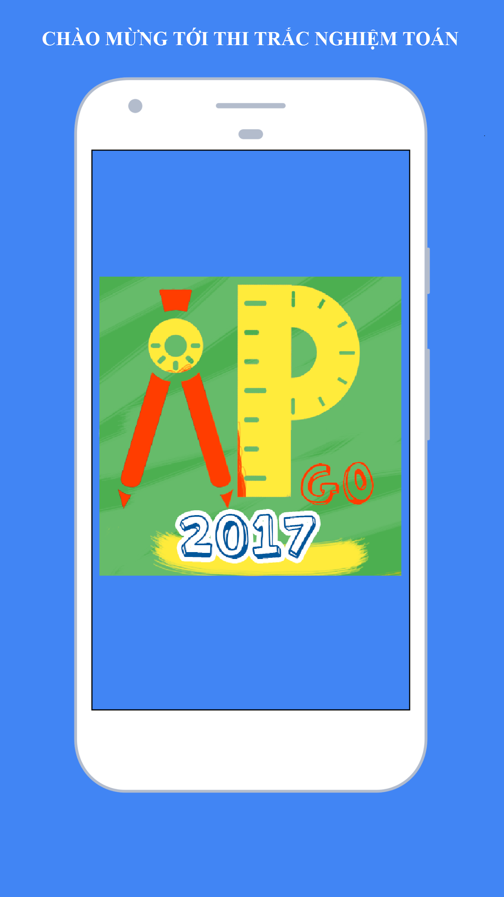
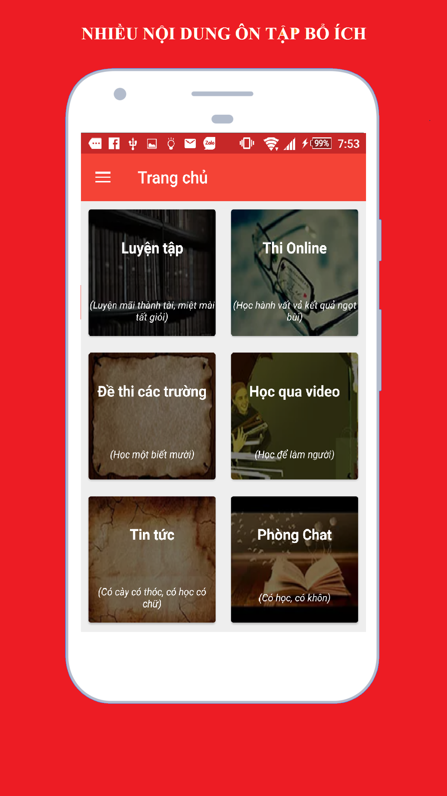
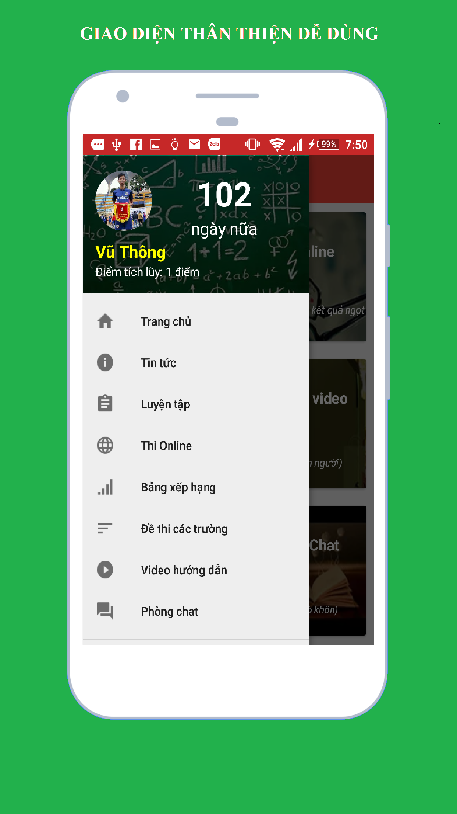
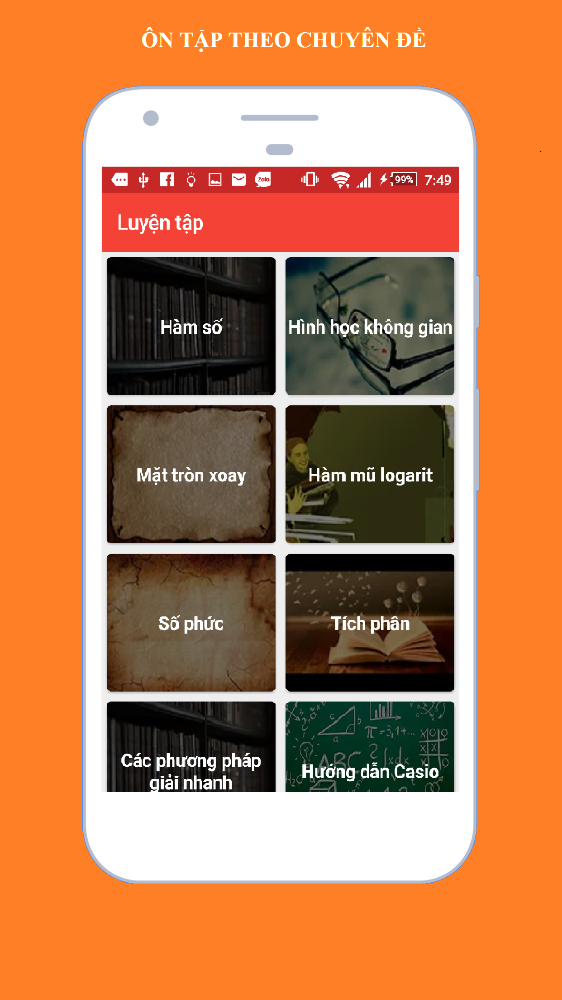
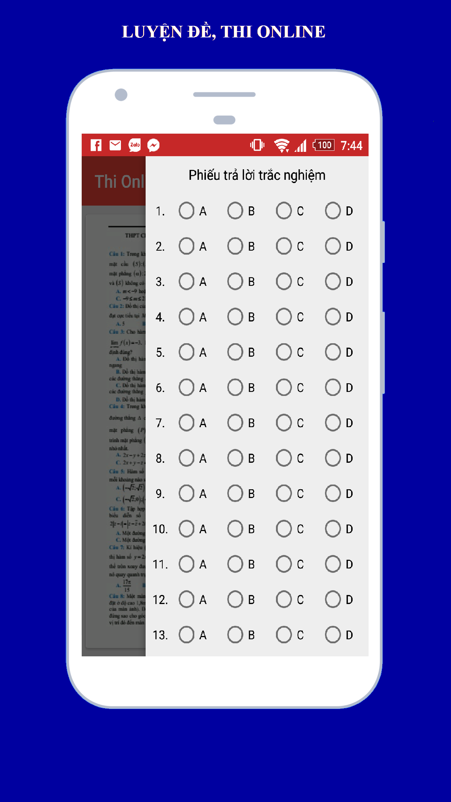

# Ứng dụng Trắc nghiệm Toán
# Tác giả: Nhóm Alpha Go

##Hình ảnh demo:

##File apk demo
<a href="demo/app-release.apk"> Tải ngay </>

##Danh sách các thư viện mã nguồn mở sử dụng trong project:

###1. FloatingActionButton
https://github.com/futuresimple/android-floating-action-button

###2. Jsoup
https://jsoup.org

###3. CircleImageView
https://github.com/hdodenhof/CircleImageView

###4. Glide
https://github.com/bumptech/glide

###5.Draggable Panel
https://github.com/pedrovgs/DraggablePanel

###6.Android PdfViewer
https://github.com/barteksc/AndroidPdfViewer

###7.Ion
https://github.com/koush/ion

###8. Material Dialogs
https://github.com/afollestad/material-dialogs

###9.SlidingIntroScreen
https://github.com/MatthewTamlin/SlidingIntroScreen

###10. PinchImageView
https://github.com/boycy815/PinchImageView

###12. MathJax
https://github.com/mathjax/MathJax

##Ngoài ra ứng dụng có sử dụng:

###1. Firebase
https://firebase.google.com/
###2. Facebook sdk và Facebook API
https://developers.facebook.com/docs/
